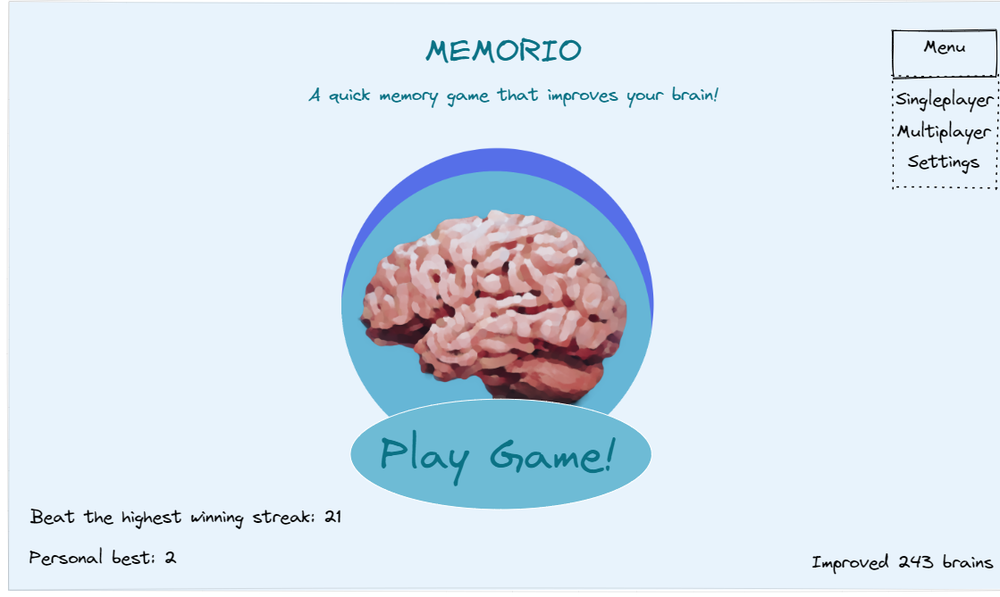
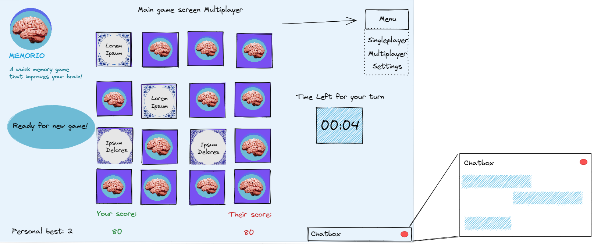

*The source code can also be found on github
[here](https://github.com/mennohie/memory-project-webdb/). Furthermore,
the game can be played [here (https does not work):
http://memorio-game.herokuapp.com/](http://memorio-game.herokuapp.com/).
At last, the brightspace blog post that refers to our project can be
found
[here](https://brightspace.tudelft.nl/d2l/le/399713/discussions/threads/115930/View?searchText=81)*

Assingment I
============

HTTP request messages: GET/HEAD
-------------------------------

### The request

**Question:** *Write down the HTTP requests you made, the returned
responses (e.g. a page has temporarily/permanently moved or is faulty)
until you receive the desired contents with status code 200 OK. Always
use HEAD first to retrieve meta-­data about the resource.*

using `telnet reddit.com 80` we start the connection with *reddit.com*.
Next, we make a `HEAD` request to `/r/tudelft`. This is done with the
following HTTP request:

    HEAD /r/tudelft HTTP/1.1
    host:www.reddit.com

From this we get the following response

    HEAD /r/tudelft HTTP/1.1
    host:www.reddit.com

    HTTP/1.1 301 Moved Permanently
    Retry-After: 0
    Location: https://www.reddit.com/r/tudelft
    Content-Length: 0
    Accept-Ranges: bytes
     ...

This indicates that it moved the request to a new location:
`https://www.reddit.com/r/tudelft`. From this we say that it moved the
HTTP request to a https request. This means we will require **openssl**
to connect to `reddit.com`. We do this with the following:

    openssl s_client -crlf -connect www.reddit.com:443

Then making the same `HEAD` request we made earlier gives us the
following:

    HEAD /r/tudelft HTTP/1.1
    host:www.reddit.com

    HTTP/1.1 200 OK
    Connection: keep-alive
    Cache-control: private, s-maxage=0, max-age=0, must-revalidate, no-store
    Content-Type: text/html; charset=utf-8

The status `200 OK` indicates that the request was successful. Now we
will make the `GET` request.

    GET /r/tudelft HTTP/1.1
    host:www.reddit.com

    HTTP/1.1 200 OK
    Connection: keep-alive
    Cache-control: private, s-maxage=0, max-age=0, must-revalidate, no-store
    Content-Type: text/html; charset=utf-8

### The response

**Question**: *Does the content you received correspond to what you see
when accessing the resource with your browser?*

The content appears to be html text that is effectively (and unreadably)
compressed in the response body. When loading the html text in a browser
the result appears to look like the a reddit page.

### 

**Question**: *Open your browser's developer tools and head to
https://www.reddit.com/r/TUDelft/. Take a look at the response header of
the first resource retrieved with status code 200 OK: what does its
Cache-Control header field mean?*

The `Cache-control` says
`private, s-maxage=0, max-age=0, must-revalidate, no-store`

As quoted from the documentation
[here](https://developer.mozilla.org/en-US/docs/Web/HTTP/Headers/Cache-Control):

-   The `max-age=0` response directive indicates that the response
    remains fresh until 0 seconds after the response is generated.

-   The `s-maxage` response directive also indicates how long the
    response is fresh for (similar to `max-age`) --- but it is specific
    to shared caches, and they will ignore max-age when it is present.

-   The `must-revalidate` response directive indicates that the response
    can be stored in caches and can be reused while fresh. Once it
    becomes stale, it must be validated with the origin server before
    reuse.

-   The `private` response directive indicates that the response can be
    stored only in a private cache (e.g. local caches in browsers).

-   The `no-store` response directive indicates that any caches of any
    kind (private or shared) should not store this response.

So, since the `max-age` and `s-max-age` are set to 0, the response is
not-fresh immediately after its recipient got the response. In
combination with `must-revalidate` this requires the page to refresh
from the origin server before reuse instead of using any stored caches.
However, generally, the response should not be stored at all (by
`no-store`).

This seems as a logical choice for reddit, as the page should be
refreshed with its content on usage to contain the latest news.

### 

**Question** *If we stick to the resource considered in 1.3), what do we
learn about the type of encodings your browser supports?*

The value for the `Content-encoding` is `gzip`. This suggests that the
browser used (Google Chrome) supports gzip.

HTTP request messages: PUT
--------------------------

We make a `PUT` request to `httpbin.org/put` with \"Hello World!\" and
obtain a response as follows:

    PUT /put HTTP/1.1
    host:httpbin.org
    Content-type:text/plain
    Content-length:12

    Hello World!
    HTTP/1.1 200 OK
    Date: Sat, 15 Jan 2022 19:46:10 GMT
    Content-Type: application/json
    Content-Length: 338
    Connection: keep-alive
    Server: gunicorn/19.9.0
    Access-Control-Allow-Origin: *
    Access-Control-Allow-Credentials: true

    {
      "args": {},
      "data": "Hello World!",
      "files": {},
      "form": {},
      "headers": {
        "Content-Length": "12",
        "Content-Type": "text/plain",
        "Host": "httpbin.org",
        "X-Amzn-Trace-Id": "Root=1-61e3247e-139fbc4c79072b7211a6c33b"
      },
      "json": null,
      "origin": "85.144.203.142",
      "url": "http://httpbin.org/put"
    }

### Other resource

**Question**: *What happens if you try to replace /put in this exercise
with another resource (e.g. /myfile)? Does the httpbin.org server allow
the creation of a new resource?*

If we make a `PUT` request to `httpbin.org/myfile`, the `httpbin.org`
server denies the request as it can not find `/myfile` (it gives a 404
Not Found error code).

    PUT /myfile HTTP/1.1
    host:httpbin.org
    Content-type:text/plain
    Content-length:12

    HTTP/1.1 404 NOT FOUND
    Date: Sat, 15 Jan 2022 19:48:21 GMT
    Content-Type: text/html
    Content-Length: 233
    Connection: keep-alive
    Server: gunicorn/19.9.0
    Access-Control-Allow-Origin: *
    Access-Control-Allow-Credentials: true

    <!DOCTYPE HTML PUBLIC "-//W3C//DTD HTML 3.2 Final//EN">
    <title>404 Not Found</title>
    <h1>Not Found</h1>
    <p>The requested URL was not found on the server.  If you entered the URL manually please check your spelling and try again.</p>
    Connection closed by foreign host.

### Content-length

**Question**: *The Content-­length is exactly the number of characters
(12 - we count the whitespace as well!) of Hello World!. What happens if
the Content-length field is smaller or larger than the exact number of
characters in the content?*

If the content-length is longer than the actual content, the request is
still process and the server responds with status OK (200) If the
Content-length is too short (shorter than the length of the content),
The server responds with a Bad Request (400).

Basic authentication
--------------------

### 

**Question**: *First, open <http://httpbin.org/basic-auth/user/passwd>
in your browser. You should see a dialogue, requesting username and
password. Use user as username and passwd as password (it is just a
coincidence that the actual username and password is the same as the URL
path). Reload the web page---do you have to fill in the login details
again? Why or why not?*

The resulting page shows the following message:

\
\"authenticated\": true,\
\"user\": \"user\"\
\

When the page is reloaded the credentials are not asked again. This is
because the `Authorization` header has been set in the cookies of the
browser. The `Authorization` header looks as follows:

\
Authorization: Basic dXNlcjpwYXNzd2Q= \

Apperantly, the `Authorization` header correctly authorizes the access
to the page. If the header is removed from cookies, the credentials are
asked again.

### 

If we make the same request with `telnet`, we get the following
response:

    HEAD /basic-auth/user/passwd HTTP/1.1
    host:httpbin.org

    HTTP/1.1 401 UNAUTHORIZED
    Date: Sun, 16 Jan 2022 16:31:28 GMT
    Content-Length: 0
    Connection: keep-alive
    Server: gunicorn/19.9.0
    WWW-Authenticate: Basic realm="Fake Realm"
    Access-Control-Allow-Origin: *
    Access-Control-Allow-Credentials: true

We get an unauthorized status response. If we add a (correct)
`Authorization` header to the request, we actually are able to make the
request. We get a correct `Authorization` header by encoding our
username and password. Or, we can copy the cookie value from the
browser.

    HEAD /basic-auth/user/passwd HTTP/1.1
    host:httpbin.org
    Authorization: Basic dXNlcjpwYXNzd2Q=

    HTTP/1.1 200 OK
    Date: Sun, 16 Jan 2022 16:34:16 GMT
    Content-Type: application/json
    Content-Length: 47
    Connection: keep-alive
    Server: gunicorn/19.9.0
    Access-Control-Allow-Origin: *
    Access-Control-Allow-Credentials: true

Now, if we retry this without the `Authorization` header, analogous to
reloading the page, we again get an unauthorized response. While the
browser stores the `Authorization` header, `telnet` does not.

    HEAD /basic-auth/user/passwd HTTP/1.1
    host:httpbin.org

    HTTP/1.1 401 UNAUTHORIZED
    Date: Sun, 16 Jan 2022 16:36:52 GMT
    Content-Length: 0
    Connection: keep-alive
    Server: gunicorn/19.9.0
    WWW-Authenticate: Basic realm="Fake Realm"
    Access-Control-Allow-Origin: *
    Access-Control-Allow-Credentials: true

Web programming project: board game app
---------------------------------------

### Memory

**Question**: *First of all, settle on the game you will implement in
your team.*

We chose to make a memory game. To be specific a memory game with a
timer.

### Example Games

**Question**: *Find three examples of your chosen board game (in 2D)
that can be played online in a modern browser (laptop or desktop, not a
mobile device). Consider the web application's design (focus on the game
screen) based on the web design principles covered in class: to what
extent do they fulfill them? Record the game URLs.*

[**Pairs.one**](pairs.one)

-   can be played in multiple ways (Local, solo, 2 player, random )

-   A custom board size can be made (from 4x4 to 8x8)

-   A custom amount of players can be set (1 to 4)

-   Animations are smooth

-   Style is concise, but a bit boring

-   There is no sound

-   With a small amount of clicks a game can be started

[**Playingcards.io**](playingcards.io)

-   has a memory game with the 52 playing cards.

-   The cards can be used to play memory up to 4 cards.

-   A custom point counter is used Cards have to be dragged to the users
    deck if the cards match.

-   There is a lot of freedom, but a bit too much. It is not very
    evident how to play a "matching" game with this.

-   The design is not distractive.

[**Match the Memory**](https://matchthememory.com/)

-   Custom board choices, and a couple different saved board choices

-   Simple design

-   You have to scroll for bigger games which is not really great

-   Simple sounds

-   Customizable amount of pairs

-   Only single player

### Positives and Negatives

**Question**: *Which game features in the game examples of 4.2) stand
out positively and which stand out negatively (e.g. particular
animations, sounds, information conveyed about the game to the players
...)? Why? Discuss three positive and three negative features.*

**Positives**

-   Customizability (in all three)

-   Smooth animation (in Pairs.io)

-   No distractions (in Playingcards.io and Pairs.io)

-   Few required clicks to start a game (in Playingcards.io and
    Pairs.io)

**Negatives**

-   Too much freedom (in Playingcards.io)

-   Hard to start a game (in Match the Memory)

-   Non-self explanatory design (in Playingcards.io)

Design your own board game app
------------------------------

### Splash Screen

**Question**: *Create a design for the splash screen (also known as
entry page): think of a name for your application, a short description &
a logo. Feel free to use media (images, sound) with a Creative Commons
license. The noun project can be a useful resource for game pieces.*

The design of our splash screen can be found in figure
[1](#fig:splash_screen){reference-type="ref"
reference="fig:splash_screen"}

{#fig:splash_screen
width="\\textwidth"}

### Game Screen

**Question**: *Create a design for the game screen, keeping the
requirements listed above in mind as well as your findings in Exercise
4.3). You have a lot of artistic freedom in designing the board and game
information.*

The design of our game screen can be found in figure
[2](#fig:game_screen){reference-type="ref" reference="fig:game_screen"}

{#fig:game_screen
width="100%"}

### Blog Post

**Memorio** - a quick memory game that improves your brain - that is our
motto.

The game is a fast-paced two-player memory game with a time limit of (to
be determined) seconds per turn. he images on the memory cards show
\"Delfts Blauwe\" tiles with arbitrary wisdom proverbs The game improves
your brain in two ways:

-   It increases your short term memory by playing the memory card game

-   It increases your wisdom by reading the wisdom proverbs. ;-)

Furthermore, we chose to show statistics on how many brains were
improved (amount of games played). We also show the highest winning
streak on the splash screen together with your own personal best winning
streak.

### Initial `game.html` and `splash.html`

The initial game screen html file and splash screen html file can be
seen
[here](https://github.com/mennohie/memory-project-webdb/blob/d7e7d1c3f0c67e9dbcf54ca13b5a8b2b9df77845/public/game.html)
and
[here](https://github.com/mennohie/memory-project-webdb/blob/d7e7d1c3f0c67e9dbcf54ca13b5a8b2b9df77845/public/splash.html)
respectively.

Assignment II
=============

Boilerplate Code
----------------

The result from creating the boilerplate code with the express can be
found
[here](https://github.com/mennohie/memory-project-webdb/commit/0c1ac83a4d52c7b3378ce29ae22cf216194b26d4)

Client-side Javascript
----------------------

### Components and Functionalities

**Question**: *Before you start coding, you need to have a plan of what
needs to be done. Focus on your game.html page. We will deal with
splash.html in the next assignment. Check the required functionalities
of your game listed in the first web assignment once again. Make a list
of all interactive UI elements you need and their functionality.*

In figure [3](#fig:uml_components){reference-type="ref"
reference="fig:uml_components"} an overview of all the components (not
strictly UML, despite the look) and functionalities of the game can be
found.

{#fig:uml_components
height="0.5\\textheight"}

### Design Patterns

**Question**: *Think about the design of your JavaScript code---which
aspects of your action plan can you translate into objects? It will make
sense to separate the game logic from the game interface. For example,
you might want to create different objects for: the game state; the game
board; the game items. Choose at least one of the object design patterns
introduced in the lecture and implement your objects accordingly. The
basic constructor pattern is the simplest one to implement, the module
pattern is more complex but preferable for code maintainability. Feel
free to try more than one design pattern. This is your chance to use and
learn about the introduced design patterns in more detail!*

We use a *Class*
[ES2015](https://developer.mozilla.org/en-US/docs/Web/JavaScript/Reference/Classes)
to design several client-side objects such as:

-   [Game](https://github.com/mennohie/memory-project-webdb/blob/34a6ba670b041a60b2915c33ae894a1768a40f82/memorio/public/javascripts/game.js)

-   [cardGrid](https://github.com/mennohie/memory-project-webdb/blob/34a6ba670b041a60b2915c33ae894a1768a40f82/memorio/public/javascripts/cardGrid.js)

We also use the *Constructor* design pattern for client-side
[Card](https://github.com/mennohie/memory-project-webdb/blob/34a6ba670b041a60b2915c33ae894a1768a40f82/memorio/public/javascripts/cardGrid.js)

At last, we use a *prototype* design pattern for server-side
[Game](https://github.com/mennohie/memory-project-webdb/blob/34a6ba670b041a60b2915c33ae894a1768a40f82/memorio/game.js)

### Client Side Memory Game

We implemented a basic client side (non-functional) game
[here](https://github.com/mennohie/memory-project-webdb/commit/6b39c67993f45905e8d1d087a9392466e1f71779).
The basic game object classes exist and basic interactions work.

Node.js
-------

The bulk of the implementing work was done here. The final result apart
from some styling with css is what has been done for this part.

Assignment III
==============

CSS
---

### Splash Screen

**Question**: *First, work on your splash screen and style the page with
CSS according to your design. To ensure that everyone learns the basics
of CSS, we provide a list of must-have CSS properties. Your code must
include at least one instance of each of the following: pseudo-classes
:hover and :active; pseudo-elements ::after and ::before; display:grid
and position:absolute; a CSS animation.*

**pseudo-classes**: We add a *hover* effect on the large play button. It
increases in size. Furthermore, we add an *active* effect on the button
that changes the color of the image. At last, we add a transition
property to the hover effect such that the transitions are smooth.

    .play-image:hover {
      transform: translate(-50%, -50%) scale(1.1);
      transition-duration: 0.5s;
    }

    .play-image:active {
      filter: hue-rotate(180deg);
    }

**pseudo-elements**

We add a fire emoticon before and after the statistics displayed on the
splash screen. We also add a \"`#`\" symbol before the statistic value.

    .stat-value::before {
      content: "#";
    }

    .stat::before {
      font-weight: normal;
      content: "\01F525";
      animation: stat-enter 3.0s
    }

    .stat::after {
      font-weight: normal;
      content: "\01F525";
      animation: stat-enter 4.0s
    }

**Grid and Absolute Position**

We use a grid display to divide the splash screen into areas with
content. The same grid template is used for the splash screen as the
game screen. This gives it a coherent layout.

We use an absolute postion to center the image in a grid cell.

    .play-image {
      position: absolute;
      top: 50%;
      left: 50%;
      height: 100%;
      transform: translate(-50%, -50%);
      transition-duration: 0.5s;
      animation: image-enter 1s 1;
    }

**CSS Animation**

At last, we use an animation when the page is loaded. The large image is
scaled in **y** direction, i.e. it starts flat and than stretches out to
the original image. Also the opacity of the statistics starts at **0**
and transforms to **1**.

    @keyframes image-enter {
        0% {
            transform: translate(-50%, -50%) scale(0, .025);
        }
        50% {
            transform: translate(-50%, -50%) scale(1, .025);
        }
    }

### Game Screen CSS

**Question**: *Next, tackle the CSS for your game screen. The look of
the game screen should be coherent with the splash screen. The two are
likely to share basic CSS settings (colors, fonts, etc.); try to be
efficient and do not duplicate existing CSS code.*

The game screen shares a lot of elements with the splash screen. An
important difference is that the game board is in the center instead of
the play button. The game board has a `card-grid-container` that has a
grid layout. The container contains all cards, and has a 4 by 4 layout
achieved as follows:

    .card-grid-container {
      display: grid;
      justify-content: center;
      grid-template-columns: auto auto auto auto;
      grid-gap: 5px;
      padding: 5px;
    }

Media Query
-----------

**Question**: *To ensure that your players are aware of the screen size
limitations (i.e. the game works well on a larger screen), use media
queries to alert players if their screen resolution is below a
sufficiently large minimum. How exactly the alert looks like is up to
you. What exactly the screen resolution minimum is, is up to you. There
is no need to actually try your app on different physical devices,
Firefox (other major browsers have similar tooling) has a Responsive
Design Mode tool that provides good simulations of various devices.*

We developed the game for regular wide screen devices, so any device
with smaller screens than roughly *1100px* width will probably not have
a pleasant experience. To prevent this, we set the display of the entire
main section to none. Instead we show an error message:

``` {.html language="html"}
<div class="alert-not-available">
  We are sorry, it appears you have tunnel vision. Widen your view to a width of 1100px
</div>
```

    @media only screen and (max-width: 1100px) {
      .main-grid {
        display: none;
      }

      .alert-not-available {
        display: block;
      }
    }

Templating
----------

The following html was written on the splash page. (splash.html)

      <p class="scores">Beat the highest winning score: <span id="top-score"></span></p>
      <p class="scores">Personal best: <span id="personal-best"></span></p>
      <p class="scores">Improved <span id="brains-improved"></span> brains</p>

A client can obtain relevant server info by going to the endpoint
\"/publicserverdata\". A user does not know that, but instructions are
given in the onLoad.js file.

server-side app.js

    // @ts-ignore
    app.get('/publicserverdata', function (req, res) {
      res.send(gameStatus)
    })

client-side onLoad.js

    /* eslint-disable no-undef */
    if (getCookie('highScore') === undefined) {
      // Cookie is stored for 5 years
      setCookie('highScore', 0, 1825)
    }

    serverInfo = JSON.parse(getResponse(window.location.protocol + '//' + window.location.host + '/publicserverdata'))

    document.getElementById('personal-best').innerHTML = getCookie('highScore')
    document.getElementById('brains-improved').innerHTML = serverInfo.gamesCompleted
    document.getElementById('top-score').innerHTML = serverInfo.highScore

As you can see, onLoad.js injects serverdata in the shown spans of
splash.html. Using AJAX instead of js would probably make it possible to
update serverdata real-time instead of every refresh.

A personal best is not stored on the server but in the cookies of a
browser. It is a more simple solution than server-side personal data
storage, which would probably require registration and login.

Unfortunately, using ejs files did not properly work for some reason.
However, this method seems to work fine too.
